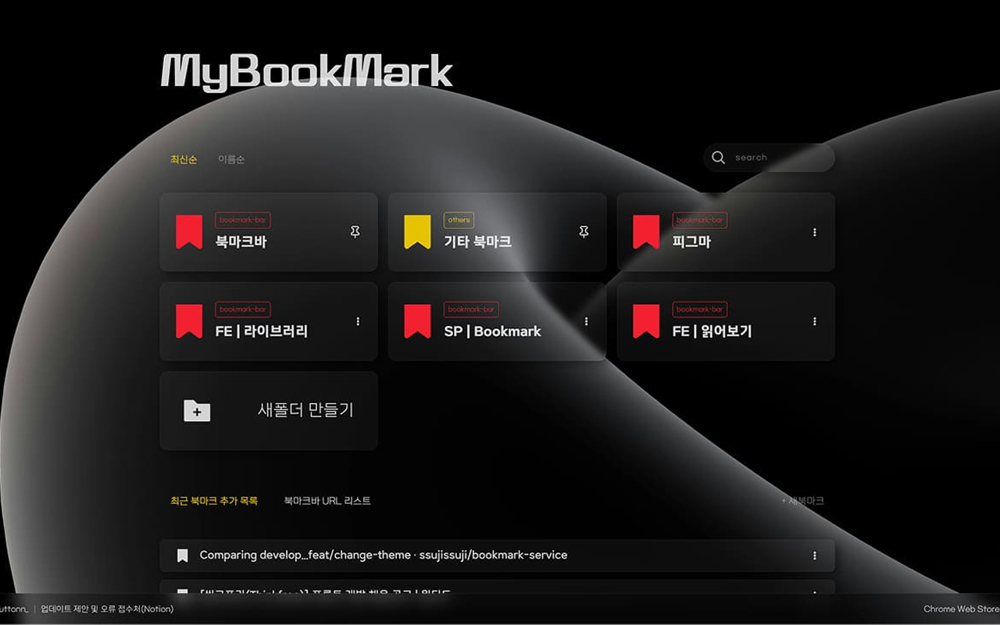
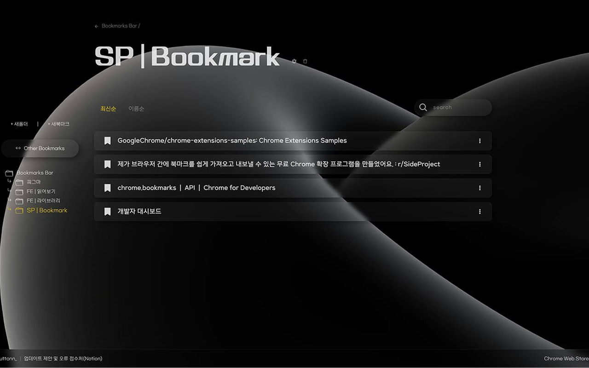
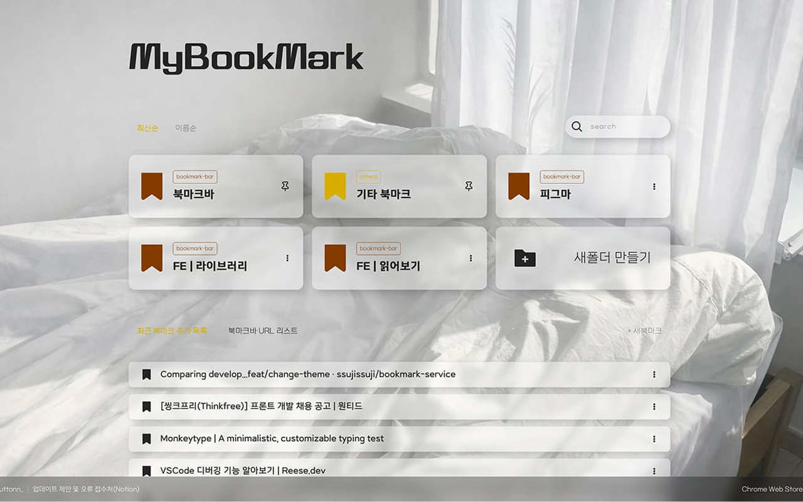

# Bookmark Extension

## 📙 프로젝트 소개

- Bookmark Extension은 Google Chrome에서 북마크를 더 빠르게 확인하고, 정렬/검색해서 관리할 수 있게 도와주는 확장 프로그램입니다.
- 보다 더 직관적인 UI로 편하게 북마크 관리를 할 수 있습니다. 
- 크롬 확장 프로그램 다운 링크 [Chrome Extension](https://chromewebstore.google.com/detail/gibfpdopdjmfjfablclemgpbfgihlbne?utm_source=item-share-cb)

| 홈 | 디테일 |
|---|---|
|  |  |
| 테마 - black | 테마 - bed |
|  |  |


## 📁 폴더 구조

```
bookmark-extension/
├── manifest.config.js           # Manifest 설정
├── package.json                 # 프로젝트 설정 및 의존성
├── tsconfig.json                # TypeScript 기본 설정
├── vite.config.js               # Vite 설정
├── public/                      # 정적 파일 (아이콘, 이미지 등)
├── release/                     # 배포 파일
├── src/                         # 소스 코드
│   ├── background.ts            # 백그라운드 스크립트
│   ├── components/              # 재사용 가능한 컴포넌트
│   ├── popup/                   # 팝업 UI

```

---

## 🧙‍♂️ 실행 방법


#### 설치 방법

1) Chrome 웹스토어에서 설치 [Chrome Extension](https://chromewebstore.google.com/detail/gibfpdopdjmfjfablclemgpbfgihlbne?utm_source=item-share-cb)

       - Chrome 웹스토어에서 Bookmark Extension을 검색합니다.
       - Chrome에 추가를 눌러 설치합니다.
       - 설치가 완료되면 브라우저 오른쪽 상단에 확장 프로그램 아이콘이 표시됩니다.


#### 사용 방법

1) 실행
	•	브라우저 우측 상단의 확장 프로그램 아이콘을 클릭하면 팝업이 열립니다.

2) 북마크 확인
	•	Chrome에 저장된 북마크/폴더 구조를 그대로 불러와서 목록으로 보여줍니다.

3) 정렬 / 검색

        -	정렬: 최신순 / 이름순 (프로젝트 구현 기준에 맞게 표기)
        -	검색: 키워드로 북마크 빠르게 찾기


#### 주요 기능

    - 크롬 북마크 자동 불러오기
    - 폴더별 북마크 탐색
    - 정렬 기능 (예: 최신순 / 이름순)
    - 검색 기능 (키워드 기반)
    - 새로운 폴더 생성
    - 새로운 북마크 생성 
    - 북마크의 폴더 위치 이동 (드래그앤드랍)
    - 폴더의 위치 이동 (드래그앤드랍)
    - 폴더 및 북마크 삭제
    - 테마 변경


---

## ⚒️ 기술 스택

- **프론트엔드**: React, TypeScript
- **번들러**: Vite
- **브라우저 API**: Chrome Extensions API
